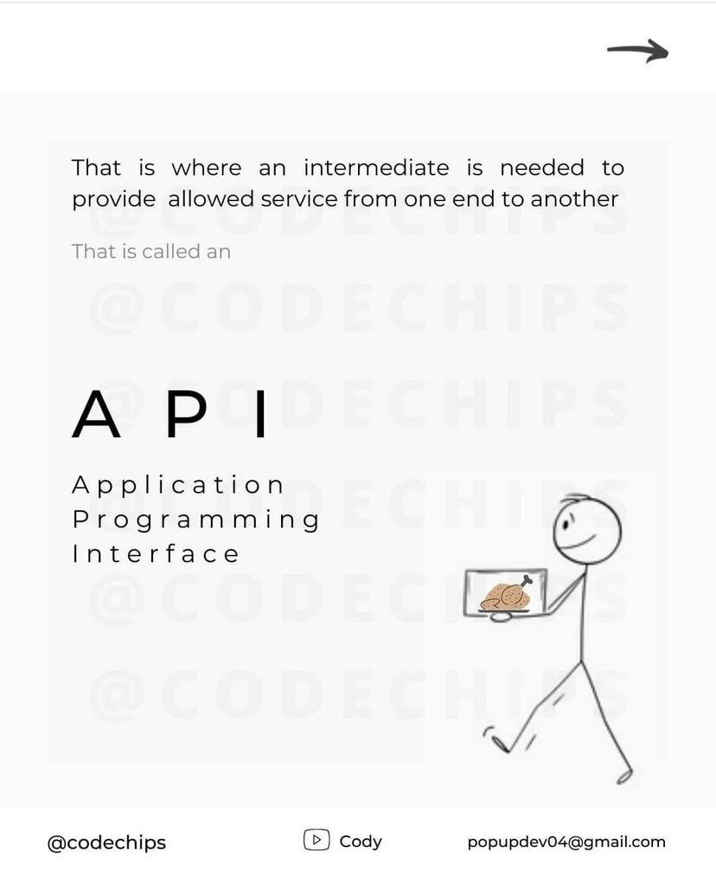
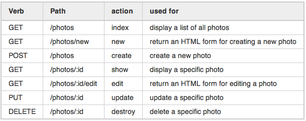
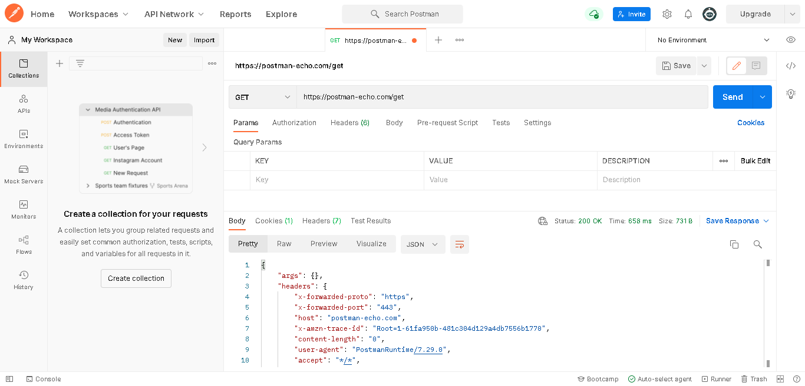
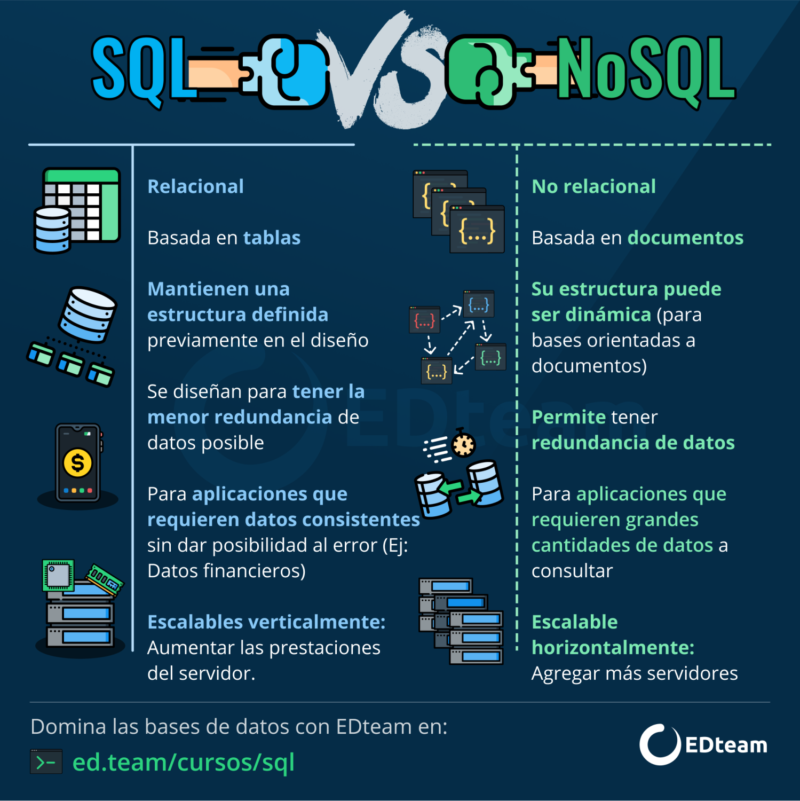

---

# Checkpoint 6

## ¿Para qué usamos Clases en Python?

Las clases en Python se usan para implementar la programación orientada a objetos (POO). La POO es una forma de organizar el código que se centra en objetos y clases en lugar de solo funciones y procedimientos. 

### ¿Qué es una Clase?

Una clase es una definición que sirve como modelo para crear objetos. Imagina que una clase es como un plano arquitectónico para una casa. El plano describe cómo se construye la casa, pero no es la casa misma. Cada casa construida a partir de ese plano es un objeto.

### ¿Qué es un Objeto?

Un objeto es una instancia de una clase, lo que significa que es una "cosa" concreta creada a partir de la clase. Siguiendo el ejemplo del plano arquitectónico, cada casa construida según ese plano es un objeto. Cada objeto tiene sus propias características (llamadas atributos) y puede realizar acciones (llamadas métodos).

Por ejemplo, si tienes una clase `Coche` que describe las características y comportamientos de un coche, cada coche específico que creas usando esa clase es un objeto. Cada coche tendrá sus propios atributos como `marca` y `modelo`, y podrá realizar acciones como `acelerar` y `frenar`.


### Ejemplo de Clase y Objeto: Biblioteca

```python
# Definimos la clase Libro
class Libro:
    def __init__(self, titulo, autor):
        self.titulo = titulo  # Atributo del título del libro
        self.autor = autor  # Atributo del autor del libro

    def mostrar_info(self):
        print(f"Título del libro: {self.titulo}, Autor: {self.autor}")

# Creamos un objeto de la clase Libro
mi_libro = Libro("Cien Años de Soledad", "Gabriel García Márquez")
mi_libro.mostrar_info()  # Output: Título del libro: Cien Años de Soledad, Autor: Gabriel García Márquez
```

En este ejemplo:

- `Libro` es la clase que define lo que es un libro y qué características tiene.
- `__init__` es el constructor de la clase que inicializa los atributos `titulo` y `autor`.
- `mostrar_info` es un método de la clase que imprime la información del libro.
- `mi_libro` es un objeto creado a partir de la clase `Libro`, representando un libro específico con el título "Cien Años de Soledad" y el autor "Gabriel García Márquez".

### Otro Ejemplo: Mascotas

```python
# Definimos la clase Mascota
class Mascota:
    def __init__(self, nombre, tipo):
        self.nombre = nombre  # Atributo del nombre de la mascota
        self.tipo = tipo  # Atributo del tipo de mascota (perro, gato, etc.)

    def hacer_sonido(self):
        if self.tipo == "perro":
            print(f"{self.nombre} dice: ¡Guau!")
        elif self.tipo == "gato":
            print(f"{self.nombre} dice: ¡Miau!")
        else:
            print(f"{self.nombre} hace un sonido desconocido.")

# Creamos objetos de la clase Mascota
mi_perro = Mascota("Fido", "perro")
mi_gato = Mascota("Michi", "gato")

mi_perro.hacer_sonido()  # Output: Fido dice: ¡Guau!
mi_gato.hacer_sonido()  # Output: Michi dice: ¡Miau!
```

En este ejemplo:

- `Mascota` es la clase que define lo que es una mascota y qué características tiene.
- `__init__` es el constructor de la clase que inicializa los atributos `nombre` y `tipo`.
- `hacer_sonido` es un método de la clase que imprime un sonido dependiendo del tipo de mascota.
- `mi_perro` y `mi_gato` son objetos creados a partir de la clase `Mascota`, representando una mascota perro y una mascota gato, respectivamente.

### Beneficios y Usos de las Clases:

1. **Encapsulación:**
   - **Definición:** Agrupa datos y métodos que operan sobre esos datos en una unidad llamada objeto.
   - **Beneficio:** Protege los datos internos del objeto y controla cómo se accede y modifica.
   - **Ejemplo:**
```python
class Libro:
    def __init__(self, titulo, autor):
        self.titulo = titulo 
        self.autor = autor  

    def mostrar_info(self):
        print(f"Título del libro: {self.titulo}, Autor: {self.autor}")

mi_libro = Libro("Cien Años de Soledad", "Gabriel García Márquez")

```

2. **Abstracción:**
   - **Definición:** Simplifica la interacción con el objeto ocultando detalles complejos y mostrando solo lo esencial.
   - **Beneficio:** Facilita el uso de objetos sin preocuparse por su implementación interna.
   - **Ejemplo:**
     ```python
     class CoffeeMachine:
         def make_coffee(self):
             self._heat_water()
             self._brew_coffee()
             self._pour_coffee()

         def _heat_water(self):
             print("Heating water...")

         def _brew_coffee(self):
             print("Brewing coffee...")

         def _pour_coffee(self):
             print("Pouring coffee...")

     machine = CoffeeMachine()
     machine.make_coffee()
     ```

3. **Reutilización de Código:**
   - **Definición:** Usa herencia para crear nuevas clases basadas en clases existentes.
   - **Beneficio:** Reduce la duplicación de código y fomenta la reutilización.
   - **Ejemplo:**
     ```python
     class Animal:
         def __init__(self, name):
             self.name = name

         def speak(self):
             raise NotImplementedError("Subclasses must implement this method")

     class Dog(Animal):
         def speak(self):
             return "Woof!"

     my_dog = Dog("Buddy")
     print(my_dog.speak())  
     ```

4. **Modularidad:**
   - **Definición:** Organiza el código en módulos bien definidos.
   - **Beneficio:** Facilita la comprensión, mantenimiento y desarrollo del código.
   - **Ejemplo:**
     ```python
     class Book:
         def __init__(self, title, author):
             self.title = title
             self.author = author

         def display_info(self):
             print(f"Title: {self.title}, Author: {self.author}")

     my_book = Book("1984", "George Orwell")
     # Output: Title: 1984, Author: George Orwell
     ```

5. **Polimorfismo:**
   - **Definición:** Permite que diferentes clases implementen métodos de la misma manera.
   - **Beneficio:** Una función puede usar objetos de diferentes clases de manera uniforme.
   - **Ejemplo:**
     ```python
     class Cat(Animal):
         def speak(self):
             return "Meow!"

     animals = [Dog("Buddy"), Cat("Whiskers")]
     for animal in animals:
         print(animal.speak())
     ```

6. **Creación de Objetos:**
   - **Definición:** Instancias de clases.
   - **Beneficio:** Cada objeto tiene su propio estado y comportamiento.
   - **Ejemplo:**
     ```python
     car1 = Car("Honda", "Civic")
     car2 = Car("Ford", "Mustang")
     # Output: Car make: Honda, model: Civic
     ```
7. **Constructores y Destructores:**
   - **Definición:** Métodos especiales para inicializar (`__init__`) y limpiar (`__del__`) recursos.
   - **Beneficio:** Controlan la creación y destrucción de objetos.
   - **Ejemplo:**
     ```python
     class Resource:
         def __init__(self, name):
             self.name = name
             print(f"Resource {self.name} created")

         def __del__(self):
             print(f"Resource {self.name} destroyed")

     resource = Resource("File")  # Output: Resource File created
     del resource  # Output: Resource File destroyed
     ```

## ¿Qué método se ejecuta automáticamente cuando se crea una instancia de una clase?

El método que se ejecuta automáticamente cuando se crea una instancia de una clase en Python se llama `__init__`. Este método es conocido como el constructor de la clase. Aquí están los detalles importantes sobre el método `__init__`:

### Definición y Propósito:
- **Definición:** Método especial que inicializa los atributos de la instancia.
- **Propósito:** Configura el objeto con valores iniciales.

### Sintaxis:
```python
class ClassName:
    def __init__(self, param1, param2):
        self.attribute1 = param1
        self.attribute2 = param2
```

### Ejemplo:
```python
class User:
    def __init__(self, username, password):
        self.username = username
        self.password = password

# Crear un objeto de la clase User
user1 = User("user123", "password123")
print(f"Username: {user1.username}, Password: {user1.password}")
```
- **Explicación:** Cuando se crea `user1`, `__init__` inicializa `username` y `password`.

### Atributos de la Instancia:
- **Uso de `self`:** Permite que cada instancia tenga sus propios atributos.
- **Ejemplo:**
  ```python
  class Person:
      def __init__(self, name, age):
          self.name = name
          self.age = age

  person1 = Person("Alice", 30)
  person2 = Person("Bob", 25)
  print(person1.name, person1.age)  # Output: Alice 30
  print(person2.name, person2.age)  # Output: Bob 25
  ```

### Validación en `__init__`:
- **Propósito:** Validar parámetros y lanzar excepciones si es necesario.
- **Ejemplo:**
  ```python
  class Account:
      def __init__(self, owner, balance):
          self.owner = owner
          if balance < 0:
              raise ValueError("Balance cannot be negative")
          self.balance = balance

  account = Account("Alice", 100)
  ```

En resumen, las clases en Python son esenciales para estructurar y organizar el código de manera intuitiva y eficiente. El método `__init__` es fundamental para inicializar objetos, asegurando que cada instancia comience con un estado válido y coherente.

## ¿Qué es el polimorfismo?

El polimorfismo es un concepto de la programación orientada a objetos (POO) que se refiere a la capacidad de objetos de diferentes clases de responder al mismo mensaje (llamada a un método) de manera diferente. Esto significa que objetos de distintas clases pueden compartir el mismo nombre de método, pero cada clase puede tener su propia implementación del método.

### Características del Polimorfismo:

1. **Mismo Nombre de Método:**
   - En el polimorfismo, varios objetos de diferentes clases pueden tener métodos con el mismo nombre.

2. **Comportamiento Diferente:**
   - A pesar de tener el mismo nombre de método, cada clase puede tener su propia implementación del método, realizando acciones específicas para esa clase.

3. **Flexibilidad:**
   - El polimorfismo brinda flexibilidad en el diseño del código, permitiendo que diferentes clases compartan comportamientos similares.

### Ejemplo de Polimorfismo:

```python
class Marino:  # Clase Padre
    def hablar(self):  # Método Hablar
        print("Hola..")

class Pulpo(Marino):  # Clase Hija
    def hablar(self):  # Método Hablar
        print("Soy un Pulpo")

class Foca(Marino):  # Clase Hija
    def hablar(self, mensaje):  # Método Hablar
        print(mensaje)
```

- `Marino` es la clase base con un método `hablar` que imprime "Hola..".
- `Pulpo` es una subclase de `Marino` que redefine el método `hablar` para imprimir "Soy un Pulpo".
- `Foca` es una subclase de `Marino` que redefine el método `hablar` para aceptar un argumento `mensaje` y lo imprime.

### Creación de Instancias y Llamadas a Métodos

```python
Pulpito = Pulpo()  # Instancia de Pulpo
Foca = Foca()  # Instancia de Foca

Pulpito.hablar()  # Llamada al método hablar de Pulpo
# Output: Soy un Pulpo

Foca.hablar("Soy una foca, este es mi mensaje")  # Llamada al método hablar de Foca
# Output: Soy una foca, este es mi mensaje
```

- `Pulpito` es una instancia de la clase `Pulpo`. Cuando se llama a su método `hablar`, se ejecuta la implementación de `hablar` de la clase `Pulpo`.
- `Foca` es una instancia de la clase `Foca`. Cuando se llama a su método `hablar` con un argumento, se ejecuta la implementación de `hablar` de la clase `Foca`, que imprime el mensaje pasado como argumento.

### Explicación del Polimorfismo

En este ejemplo, el polimorfismo se demuestra de la siguiente manera:

- La clase `Marino` define un método `hablar`, que es heredado por las subclases `Pulpo` y `Foca`.
- Cada subclase proporciona su propia implementación del método `hablar`, lo que permite que diferentes tipos de objetos (`Pulpo` y `Foca`) respondan de manera diferente a la misma llamada de método (`hablar`).
- La capacidad de los objetos de `Pulpo` y `Foca` de responder al método `hablar` de manera específica muestra el concepto de polimorfismo, donde una misma interfaz (método `hablar`) puede ser utilizada para diferentes tipos de objetos, cada uno con su propia implementación.

Por lo tanto, el código ilustra claramente cómo funciona el polimorfismo en Python, permitiendo que objetos de diferentes clases respondan de manera específica al mismo mensaje o llamada de método.

## ¿Qué es una API?

Una API es esencialmente un conjunto de reglas y herramientas que define cómo se pueden comunicar diferentes componentes de software entre sí. Imagina que estás en un restaurante y quieres hacer un pedido al chef. Tú no necesitas saber cómo preparar la comida, solo necesitas comunicarle qué quieres. Aquí, el menú actúa como una API: proporciona una lista de opciones que puedes pedir y define cómo se deben solicitar esas opciones. De manera similar, una API en el mundo de la programación proporciona una forma estandarizada para que las aplicaciones se comuniquen entre sí.




### ¿Por qué se utiliza?

Las API son fundamentales en el desarrollo de software por varias razones:

1. **Reusabilidad y modularidad**: Permiten a los desarrolladores acceder a funciones específicas de una aplicación o servicio sin necesidad de entender cómo están implementadas internamente. Esto promueve la reutilización del código y facilita el desarrollo de software modular y escalable.

2. **Interoperabilidad**: Facilitan la integración de sistemas y la comunicación entre aplicaciones desarrolladas por diferentes equipos o incluso por diferentes organizaciones. Esto es crucial en un mundo donde las aplicaciones suelen depender de servicios externos para funcionar correctamente.

3. **Abstracción y simplificación**: Las API proporcionan una capa de abstracción que oculta la complejidad interna de un sistema, lo que hace que sea más fácil para los desarrolladores utilizarlo sin tener que preocuparse por los detalles de implementación.

### Ejemplo:

Supongamos que estás desarrollando una aplicación de redes sociales. Para que los usuarios puedan iniciar sesión en tu aplicación, probablemente querrás utilizar una API de autenticación como OAuth. En lugar de implementar todo el proceso de autenticación desde cero, puedes utilizar la API de OAuth, que te proporciona un conjunto de endpoints y métodos para manejar el inicio de sesión de forma segura y eficiente.

### Sintaxis:

La sintaxis de una API puede variar dependiendo del servicio o plataforma que estés utilizando. Sin embargo, muchas API están basadas en solicitudes HTTP, donde se utilizan diferentes métodos (o verbos) para realizar acciones sobre los recursos. Los métodos más comunes son GET, POST, PUT y DELETE.

## ¿Cuáles son los tres verbos de API?

Los tres verbos más comunes utilizados en las API son:

1. **GET**: Se utiliza para recuperar datos de un recurso. Por ejemplo, al hacer una solicitud GET a una API de clima, puedes obtener los datos meteorológicos de una ciudad específica.

2. **POST**: Se utiliza para enviar datos a un recurso para crearlo. Por ejemplo, al enviar un formulario de registro en un sitio web, los datos se envían al servidor utilizando una solicitud POST para crear una nueva cuenta de usuario.

3. **DELETE**: Se utiliza para eliminar un recurso. Por ejemplo, al hacer una solicitud DELETE a una API de gestión de tareas, puedes eliminar una tarea específica de tu lista.

4. **PUT**: Se utiliza para actualizar un recurso existente con los datos proporcionados. Por ejemplo, si deseas cambiar la información de perfil de un usuario en una aplicación, puedes utilizar una solicitud PUT para enviar los nuevos datos al servidor y actualizar la información del usuario.

Estos verbos son esenciales para interactuar con una API y realizar diferentes operaciones sobre los recursos disponibles. Otros verbos comunes incluyen PUT (para actualizar un recurso) y PATCH (para realizar actualizaciones parciales de un recurso).



###  Ejemplos :


```python
from flask import Flask, request, jsonify

app = Flask(__name__)


users = {
    1: {"name": "Alice", "email": "alice@example.com"},
    2: {"name": "Bob", "email": "bob@example.com"}
}
tasks = {
    123: {"task": "Complete assignment", "status": "Pending"}
}

@app.route('/weather', methods=['GET'])
def get_weather():
   
    url = 'url de una API waether'
    response = requests.get(url)
    return jsonify(response.json())

@app.route('/register', methods=['POST'])
def register_user():
    data = request.json
    new_id = len(users) + 1
    users[new_id] = data
    return jsonify(users[new_id]), 201

@app.route('/tasks/<int:task_id>', methods=['DELETE'])
def delete_task(task_id):
    if task_id in tasks:
        del tasks[task_id]
        return '', 204
    else:
        return jsonify({"error": "Task not found"}), 404

@app.route('/users/<int:user_id>', methods=['PUT'])
def update_user(user_id):
    if user_id in users:
        data = request.json
        users[user_id].update(data)
        return jsonify(users[user_id])
    else:
        return jsonify({"error": "User not found"}), 404

if __name__ == '__main__':
    app.run(debug=True)
```

### Explicación de cada ruta:

1. **GET `/weather`**: Realiza una solicitud GET a una API de clima para obtener información del clima de Londres.
    ```python
    @app.route('/weather', methods=['GET'])
    def get_weather():
        url = 'url api'
        response = requests.get(url)
        return jsonify(response.json())
    ```

2. **POST `/register`**: Crea un nuevo usuario y lo agrega a la lista de usuarios simulados.
    ```python
    @app.route('/register', methods=['POST'])
    def register_user():
        data = request.json
        new_id = len(users) + 1
        users[new_id] = data
        return jsonify(users[new_id]), 201
    ```

3. **DELETE `/tasks/<int:task_id>`**: Elimina una tarea específica de la lista de tareas simuladas.
    ```python
    @app.route('/tasks/<int:task_id>', methods=['DELETE'])
    def delete_task(task_id):
        if task_id in tasks:
            del tasks[task_id]
            return '', 204
        else:
            return jsonify({"error": "Task not found"}), 404
    ```

4. **PUT `/users/<int:user_id>`**: Actualiza la información del perfil de un usuario específico.
    ```python
    @app.route('/users/<int:user_id>', methods=['PUT'])
    def update_user(user_id):
        if user_id in users:
            data = request.json
            users[user_id].update(data)
            return jsonify(users[user_id])
        else:
            return jsonify({"error": "User not found"}), 404
    ```

### Cómo probar:

- **GET**: Accede a `http://127.0.0.1:5000/weather` en tu navegador o utiliza una herramienta como Postman para enviar una solicitud GET.
- **POST**: Envía una solicitud POST a `http://127.0.0.1:5000/register` con un cuerpo JSON en Postman.
- **DELETE**: Envía una solicitud DELETE a `http://127.0.0.1:5000/tasks/123` en Postman.
- **PUT**: Envía una solicitud PUT a `http://127.0.0.1:5000/users/1` con un cuerpo JSON en Postman.


### Qué es Postman

Postman es una herramienta que comenzó como una extensión para el navegador Chrome y ahora es una aplicación nativa disponible para Windows, Mac y Linux. Postman permite realizar peticiones de APIs REST de manera sencilla para probar y desarrollar tanto APIs propias como de terceros. La herramienta ofrece una versión gratuita y tres planes de pago: básico, profesional y empresarial.

### Para qué sirve Postman

Postman es útil para diversas tareas relacionadas con APIs:

- **Testeo de APIs:** Permite probar colecciones de APIs tanto para frontend como para backend.
- **Organización:** Facilita la organización de servicios web en carpetas, funcionalidades y módulos.
- **Gestión del ciclo de vida de APIs:** Ayuda en la conceptualización, desarrollo, monitoreo y mantenimiento de APIs.
- **Documentación:** Genera documentación de APIs.
- **Trabajo con entornos:** Soporta múltiples entornos (desarrollo, calidad, producción) y permite compartir información a través de un entorno cloud.

### Métodos más utilizados en Postman

Postman permite realizar diversas acciones sobre las APIs mediante los siguientes métodos HTTP:

- **GET:** Obtener información.
- **POST:** Agregar información.
- **PUT:** Reemplazar la información.
- **PATCH:** Actualizar alguna información.
- **DELETE:** Borrar información.

Los códigos de respuesta indican el estado de las peticiones:
- **2xx:** Petición exitosa.
- **4xx:** Errores del cliente.
- **5xx:** Errores del servidor.


### Realizar una petición en Postman

1. **Ingresar la URL:** Coloca la URL en el panel de búsqueda superior y selecciona el método “GET”.
2. **Enviar petición:** Presiona el botón “Send” para enviar la petición.
3. **Ver respuesta:** Observa el detalle de la respuesta en el panel inferior.
4. **Guardar peticiones:** Puedes guardar tus peticiones con el botón “Save”.
5. **Crear colecciones:** En el panel izquierdo, puedes crear colecciones para organizar tus peticiones por API o categoría de prueba.



### ¿Es MongoDB una base de datos SQL o NoSQL?

MongoDB es una base de datos **NoSQL**.

#### Características de MongoDB:

1. **Modelo de Datos Basado en Documentos:**
   - MongoDB almacena datos en documentos BSON (una representación binaria de JSON), lo que permite estructuras de datos complejas y jerárquicas.

2. **Flexibilidad:**
   - Los esquemas de datos en MongoDB son flexibles, permitiendo que los documentos en una misma colección tengan diferentes estructuras.

3. **Escalabilidad Horizontal:**
   - MongoDB está diseñado para escalar horizontalmente, distribuyendo datos y carga de trabajo a través de múltiples servidores.

4. **Consultas Potentes:**
   - A pesar de ser NoSQL, MongoDB ofrece una poderosa consulta y lenguaje de agregación que permite realizar operaciones complejas sobre los datos.

#### Diferencias Principales entre SQL y NoSQL:

- **SQL:**
  - Utiliza un modelo de datos tabular.
  - Requiere un esquema definido (estructuras de tablas y relaciones).
  - Ejemplos: MySQL, PostgreSQL, Oracle.

- **NoSQL:**
  - Utiliza diversos modelos de datos (documentos, grafos, columnas, claves-valor).
  - Esquema flexible o sin esquema.
  - Ejemplos: MongoDB (documentos), Neo4j (grafos), Cassandra (columnas), Redis (clave-valor).

En resumen, MongoDB es una base de datos NoSQL que ofrece flexibilidad y escalabilidad, y es adecuada para aplicaciones que requieren manejar datos semi-estructurados o sin estructura fija.




### Métodos Dunder (Métodos Especiales)

Los métodos dunder, también conocidos como métodos especiales o métodos mágicos, son funciones predefinidas en Python cuyos nombres comienzan y terminan con doble guion bajo (`__`). Estos métodos son invocados automáticamente por el intérprete de Python en ciertas situaciones, lo que les permite definir comportamientos específicos para clases y objetos.

Los métodos dunder se utilizan para proporcionar funcionalidades especiales a las clases y objetos, como la inicialización, la representación en cadena, la iteración y muchas otras. Algunos ejemplos comunes de métodos dunder incluyen:

- `__init__`: Este método se utiliza como constructor de la clase y se llama automáticamente cuando se crea una nueva instancia de la clase.
- `__str__`: Este método devuelve una representación de cadena legible para humanos del objeto y se utiliza cuando se invoca la función `str()` o cuando se imprime el objeto.
- `__len__`: Este método devuelve la longitud del objeto y se utiliza cuando se invoca la función `len()` sobre el objeto.
- `__add__`, `__sub__`, etc.: Estos métodos se utilizan para sobrecargar operadores aritméticos como la suma, la resta, etc.
- `__getitem__`, `__setitem__`: Estos métodos se utilizan para acceder y modificar elementos en contenedores (por ejemplo, listas, diccionarios) utilizando la notación de corchetes (`[]`).

Los métodos dunder proporcionan una forma estándar de interactuar con objetos en Python y son esenciales para la programación orientada a objetos en el lenguaje.

## Decoradores en Python

### Introducción

En Python, las funciones son "ciudadanos de primera clase", lo que significa que pueden ser asignadas a variables, pasadas como argumentos a otras funciones o incluso retornadas desde otras funciones. Esta flexibilidad es fundamental para entender los decoradores.

```python
def saludar():
    print('Hola, soy una función')

def super_funcion(funcion):
    funcion()

funcion = saludar  # Asignamos la función a una variable
super_funcion(funcion)  # Llamamos a la función a través de otra
```

### ¿Qué es un Decorador?

Un decorador es una función que toma otra función como argumento y devuelve una nueva función. En su forma más simple, un decorador modifica o extiende el comportamiento de la función que decora, sin cambiar su código.

```python
def funcion_a(funcion_b):
    def funcion_c():
        print('Antes de la ejecución de la función a decorar')
        funcion_b()
        print('Después de la ejecución de la función a decorar')
    return funcion_c
```

### Aplicando un Decorador

Para aplicar un decorador a una función, se usa el prefijo `@` seguido del nombre del decorador.

```python
@funcion_a
def saludar():
    print('Hola, mundo!!')

saludar()
# Salida:
# Antes de la ejecución de la función a decorar
# Hola, mundo!!
# Después de la ejecución de la función a decorar
```

### Decoradores con Argumentos

Si la función a decorar debe aceptar argumentos, el decorador puede usar `*args` y `**kwargs` para manejar cualquier número de argumentos y palabras clave.

```python
def funcion_a(funcion_b):
    def funcion_c(*args, **kwargs):
        print('Antes de la ejecución de la función a decorar')
        result = funcion_b(*args, **kwargs)
        print('Después de la ejecución de la función a decorar')
        return result
    return funcion_c

@funcion_a
def suma(a, b):
    return a + b

print(suma(10, 20))
# Salida:
# Antes de la ejecución de la función a decorar
# Después de la ejecución de la función a decorar
# 30
```

### Nombres Convencionales

Por convención, la función anidada dentro del decorador se llama `wrapper`. Los nombres de los decoradores deben ser descriptivos.

```python
def my_custom_decorator(function):
    def wrapper(*args, **kwargs):
        return function(*args, **kwargs)
    return wrapper
```

### Ejemplo Real

Un ejemplo práctico es un decorador que mide el tiempo de ejecución de una función.

```python
def measure_time(function):
    def wrapper(*args, **kwargs):
        import time
        start = time.time()
        result = function(*args, **kwargs)
        total = time.time() - start
        print(total, 'seconds')
        return result
    return wrapper

@measure_time
def suma(a, b):
    import time
    time.sleep(1)
    return a + b

print(suma(10, 20))
# Salida:
# 1.0 seconds
# 30
```

### Decoradores con Parámetros

Los decoradores pueden aceptar sus propios argumentos añadiendo una capa adicional de funciones.

```python
def my_decorator_name(name):
    def my_custom_decorator(function):
        def wrapper(*args, **kwargs):
            print('Name:', name)
            return function(*args, **kwargs)
        return wrapper
    return my_custom_decorator

@my_decorator_name('CodigoFacilito')
def suma(a, b):
    return a + b

print(suma(10, 20))
# Salida:
# Name: CodigoFacilito
# 30
```

## Bibliografía Recomendada

Para completar esta documentación, me he basado en las siguientes fuentes, las cuales también recomiendo leer para profundizar más en los temas tratados:

1. [NoSQL vs SQL: Diferencias y cuándo elegir cada una](https://pandorafms.com/blog/es/nosql-vs-sql-diferencias-y-cuando-elegir-cada-una/)
2. [¿Qué es una API?](https://plata.news/blog/que-es-una-api/)
3. [¿Qué es el polimorfismo dinámico?](https://www.dongee.com/tutoriales/que-es-el-polimorfismo-dinamico/)
4. [¿Qué es Postman?](https://openwebinars.net/blog/que-es-postman/)
5. [Polimorfismo y sobrecarga de métodos en Python](https://pythones.net/polimorfismo-sobrecarga-metodos/)
6. [Decoradores en Python](https://codigofacilito.com/articulos/decoradores-python)
7. [Tutorial de Clases en Python (Documentación Oficial)](https://docs.python.org/es/3/tutorial/classes.html)
8. [Clases en Python (HubSpot Blog)](https://blog.hubspot.es/website/clases-python)


