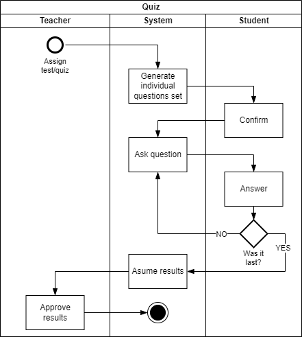

# Activity diagrams

[<< CLASS DIAGRAMS](./04_classDiagrams.md#diagramas-de-clase) | [USE CASE DIAGRAMS >>](./06_useCaseDiagrams.md#use-case-diagrams)

 

 

## Elementos

Los elementos que forman este tipo de diagramas son los siguientes:

* Punto de inicio
* Actividad o estado de acción
* Action flow
* Decisiones y ramificaciones
* Guardas
* Punto de finalización
* Swim lanes

 

 

## Punto de inicio

Se representan con un círculo con un punto en el centro. Así es como se representa cómo un sistema va a comenzar.

A continuación, vienen las actividades o estados, los cuales se representan con un rectángulo con un título en el centro.

Los *action flows* se representan con flechas que van desde un estado a otro. Estas flechas indican la secuencia de las acciones.

Las decisiones y ramificaciones se representan con un rombo. Estas decisiones tienen ramificaciones que se representan con flechas que parten de la decisión.

Las guardas son los mensajes que se muestran en las decisiones. Se escriben directamente sobre la rama de la decisión. Cuantas más guardas haya, más ramificaciones habrá, lo que significa que se trata de un sistema más complejo.

El estado final se representa con un círculo con un punto en el centro. Así es como se representa cómo un sistema va a terminar. En este caso, el círculo está pintado de negro, a diferencia del inicial, que es un círculo en blanco.

 

 

## Ejemplo

 

 

[<< CLASS DIAGRAMS](./04_classDiagrams.md#diagramas-de-clase) | [USE CASE DIAGRAMS >>](./06_useCaseDiagrams.md#use-case-diagrams)