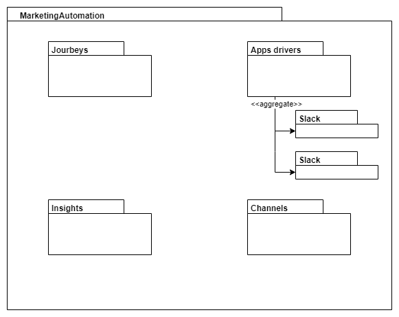

# Package diagrams

[<< DEPLOYMENT DIAGRAMS](./07_deploymentDiagrams.md#deployment-diagrams) | [SEQUENCE DUAGRAMS >>](./09_sequenceDiagrams.md#diagramas-de-secuencia)

 

Estos diagramas son una forma de envolver los demás componentes y diagramas, y aquello que representan.

Por ejemplo, en un ***Class Diagram*** se genera un listado detallado de las clases, sus atributos y métodos, las conexiones que hay entre sí, pero se describe todo en un nivel superficial. Se habla de cómo debe estar escrito el código directamente.

Sin embrago, los ***Package Diagrams*** continenen elementos abstractos, como el tipado, y también elementos más concretos que forman parte de los elementos o componentes de otros diagramas.

 

 

## Elementos

* **Abstract Elements**
    * Type
    * Classifier

* **Elements**
    * Class
    * Use Case
    * Component
    * Package
    * Dependency
    * Event

 

 

## Ejemplo

Como se puede ver en la imagen, tenemos el sistema *MarketingAutomation*, y dentro de éste, se encuentran diferentes paquetes. Los paquetes que se encuentran envueltos por éste son:

* Journeys
* Insights
* Channels
* App drivers (que también está conectado a otros paquetes)

 

Como resumen: tenemos una aplicación, y dentro de ella nos encontramos varios paquetes que la forman.

Este tipo de diagrama puede ser muy útil para tener una idea general del sistema.

 

 

[<< DEPLOYMENT DIAGRAMS](./07_deploymentDiagrams.md#deployment-diagrams) | [SEQUENCE DUAGRAMS >>](./09_sequenceDiagrams.md#diagramas-de-secuencia)