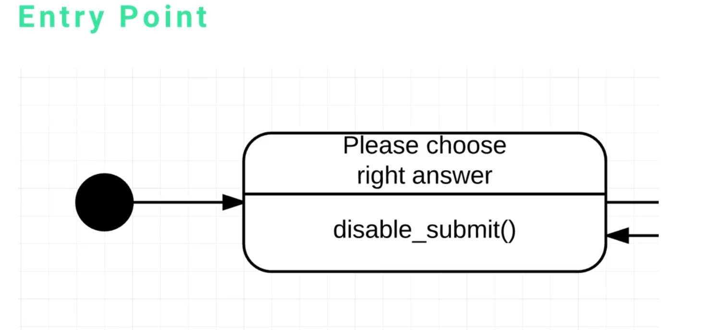
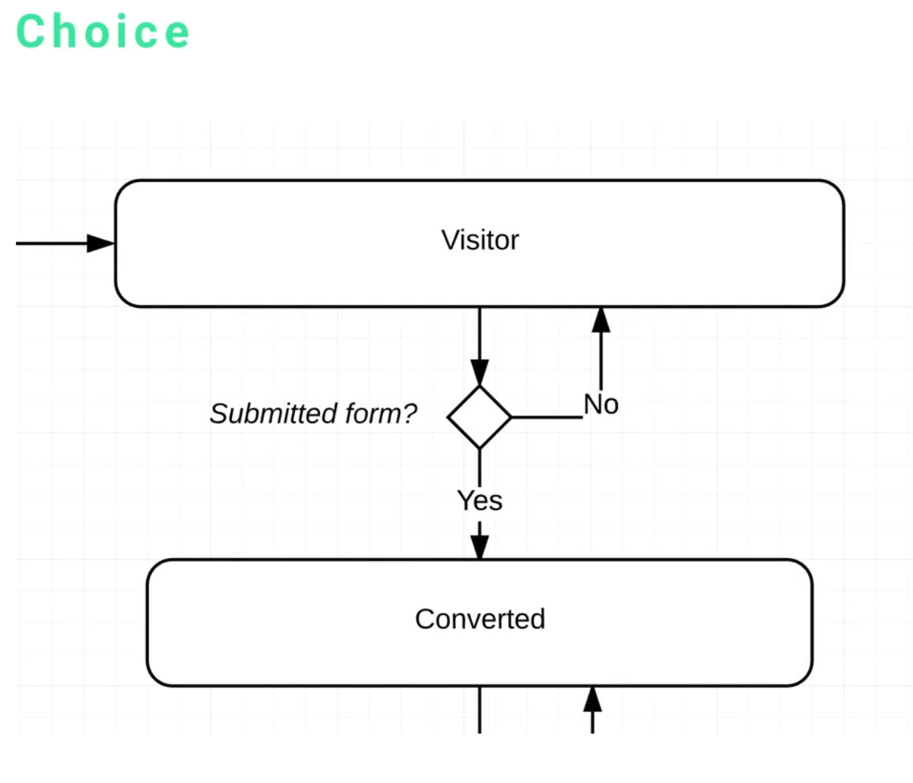

# State Machine Diagrams

[<< SEQUENCE DIAGRAMS](./09_sequenceDiagrams.md#diagramas-de-secuencia)

The goal of state machine diagrams is to visualize what an application or what a feature of our application will look like and how it can transition from one state to another state.

> In low level, it can be how a button looks linke or what actions can be performed on a button based off of how a user's role is set up.

> In high level, we can use state machines to an activity diagram where you can see where a user can go into one page and they can change into another.

 

Both activity diagrams and state machine diagrams deal with behavior, but there's a very subtle difference between the two. That is that the activity diagram works a little bit more like a flow chart, where you can have a user thar goes to one page, then they go to another page and they can be asked these questions and different behavior ensues.

A state machine cares more about the different actions that can change a user state. For example, if a user goes to a registration page, then they fill it out, then the next state may be having a different type of role for the user, their user state changed.

 

 

## Elements

* Entry point
* Choice
* Constraint
* State
* Transition

 
 

### Entry Point

It is that large filled in black dot and it represents the start. It's where if you're building a web application, it's when the user gets to the page or sees the screen.

If you're building an API or something like that, it's when the request comes in and they pass the information, just the start of the system.

 
 

### Choices

This is where it gets to asking questions. In the example below, the visitor user is asked if they submit the form. If they do, then they user is no longer a visitor, they are now a registered user, so the state changes. If they don't submit the form, then they stay a visitor and there's no change in state.

Choices are represented by 45 degree angle squares.

 
 

### Constraint

We are gonna use again the same example of [choices](#choices). The constraint in the example seen is the *yes* and then the *no*. In other diagrams, the constraint is also called a *guard*.

So that is a way of being able to say if in this case, if the form was submited or if it wasn't. However, there are other scenarios where you're going to have additional items.

 
 

### State

They are represented by the rounded edge type of rectangles.

So, in our example, we have two different states. We have the sate where the user is a visitor, and the state where they are converted to a registered user.

 
 

### Transition

The transition is the arrow that goes from one state to another state. So, in our example, we have a transition from the visitor state to the registered user state.

We also have choices that are represented by these arrows.

 

 

[<< SEQUENCE DIAGRAMS](./09_sequenceDiagrams.md#diagramas-de-secuencia)